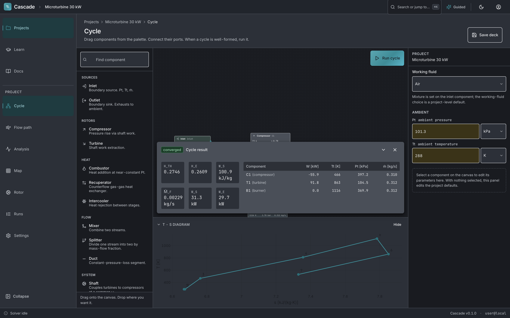
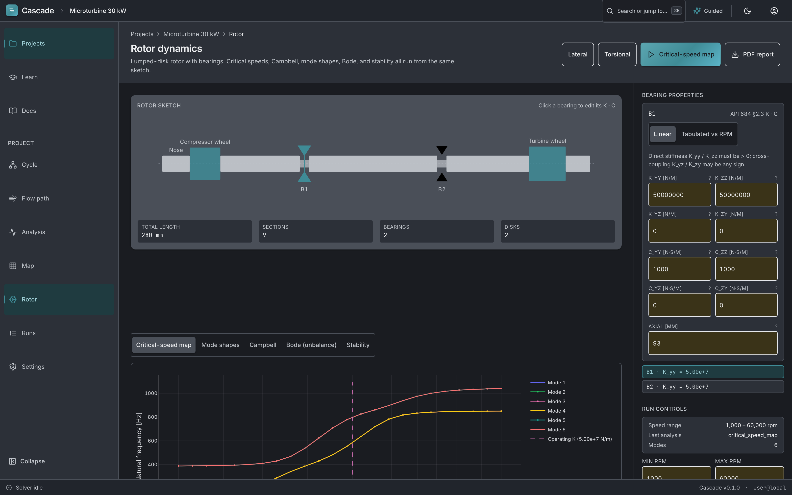
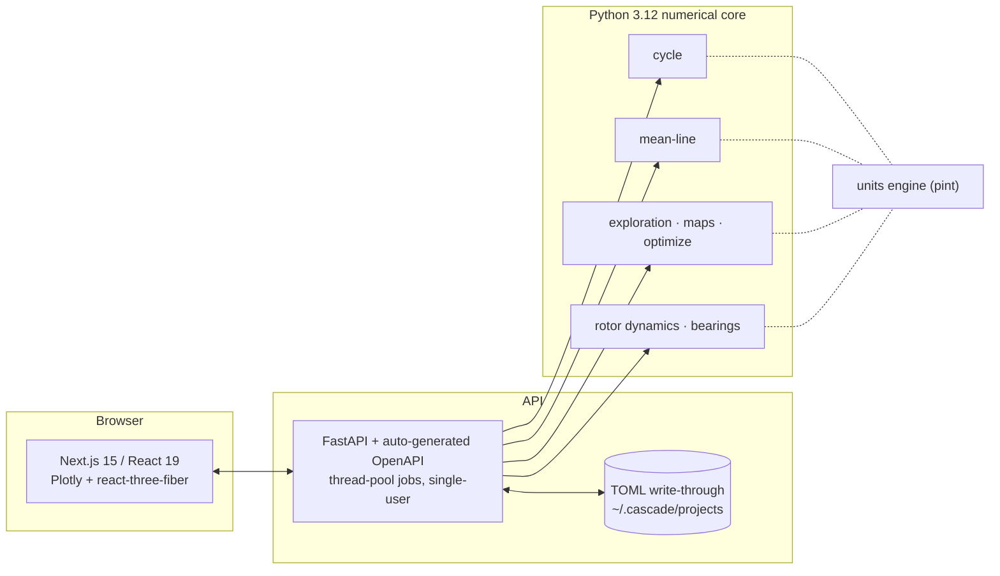

<div align="center">

# Cascade

**The web-native turbomachinery design environment for small engineering teams.**

Cycle → mean-line design → design-space exploration → performance maps → rotor dynamics,
in a browser, from one git-diffable project.

*The flow-path explorer at v0.1.0 — a Sobol' sweep, a filter expression, and the picked impeller in 3D.*

[](LICENSE)
[](pyproject.toml)
[](apps/web)
[](ROADMAP.md)
[](VALIDATION_REPORT.md)
[](scripts/check_citations.py)

</div>

```sh
make setup && make run   # then open http://localhost:3000/projects/microturbine-30kw/flowpath
```

## Why this exists

Preliminary turbomachinery design runs on a handful of excellent proprietary suites — quote-only pricing where the few public data points run well into five figures per seat-year, none of them web-native, none of them open ([market survey, June 2026](docs/research/competitive-landscape.md)). If you are a three-person team building a 30 kW natural-gas microturbine, the tooling bill can rival the hardware budget. Cascade is the open alternative: free to self-host, forever — that's the license, not a tier.

Three rules keep it honest:

1. **Every loss model carries a published citation**, enforced by a CI gate (`make check-citations`) that instantiates each model class and cross-checks its citation string against a registry.
2. **Every solver ships with a [public validation report](VALIDATION_REPORT.md)** against published cases — no marketing-only accuracy claims.
3. **Every known gap has a stable ID** in [KNOWN_GAPS.md](KNOWN_GAPS.md). Nothing unshipped is described in the present tense.

## What you can do today

| | Shipping in v0.1.0 |
|---|---|
| **Cycle design** | 0D thermodynamic solver — simple, recuperated, and multi-shaft Brayton (power-balance spool matching; map-based multi-spool matching deferred, [KG-003](KNOWN_GAPS.md)) — with a real-gas equation of state (NASA 9-coefficient polynomials + CoolProp). Burner pinned by outlet temperature or fuel mass flow. |
| **Mean-line design** | Radial inflow turbine and centrifugal compressor preliminary design with cited loss models (see table below). |
| **Design exploration** | Sobol' sampling of hundreds-to-thousands of candidate geometries — deterministic by seed — with a filter DSL (`eta_tt > 0.85 AND M_rel < 1.2`), parallel-coordinates view, and linked 3D geometry. |
| **Candidate → cycle handoff** | Pick a candidate, **Send to cycle**: its geometry lands on the cycle's compressor component. Flip that component to *Live mean-line* and the next run solves with the geometry's mean-line efficiency instead of an assumed constant — and the result panel reports exactly where every efficiency number came from. |
| **Performance maps** | Map generator with surge and choke lines and an explicit per-point status code — never an ambiguous `-1`. |
| **Rotor dynamics** | Linear Timoshenko beam-FEM with gyroscopic coupling — lateral *and* torsional: critical-speed map, unbalance response (Bode, amplification factor, separation margin), Campbell, stability. |
| **Bearings** | Plain-journal solver (finite-bearing Reynolds via Christopherson PSOR; Ocvirk short-bearing closed form; full 2×2 stiffness/damping via Lund & Thomsen). Tilt-pad, thrust, and foil bearings accept tabulated coefficients ([KG-007/008/009](KNOWN_GAPS.md)). |
| **Optimization** | SLSQP, CMA-ES, Powell (under the `OptimizeBOBYQA` name — [KG-019](KNOWN_GAPS.md)), and NSGA-II multi-objective. |
| **Units discipline** | pint-backed typed quantities end to end; the NIST SP 811 psi ↔ Pa round-trip is exact to 1 part in 10¹²; unit mismatches are refused at the boundary, not coerced. |
| **Geometry export** | GLB and STL in the base install; STEP/IGES and fluid-volume STEP via the optional `cascade[cad]` extra ([KG-G-08](KNOWN_GAPS.md)); TurboGrid NDF. |
| **Scripting & CLI** | The Python package doubles as the scripting interface; `cascade demo`, `validate`, `sweep`, `export`, plugin management. |
| **Projects** | A `.cascade` directory of TOML files with units — text-based, diffable, reviewable in a pull request. Collaboration in v0.1 is asynchronous (branch + diff + PR). |

## Validated, in public

The validation suite runs against published cases and reproduces with one command (`make validation`, ≈14 s for the pass-gate subset). As of the 2026-05-28 full-suite run: **1,115 tests passing**, of which **130 are validation pass-gates** (34 CAD-export tests skip without the optional `pythonocc-core`; 1 documented xfail). The gate is enforced locally by `make ci` before merge; public CI is pending.

| Case | Published reference | Result |
|---|---|---|
| CYC-1 — simple Brayton | Çengel & Boles Ex. 9-5 | η_th = 44.80% vs 44.79% (Δ 0.01 pt) |
| CYC-3 — Capstone C30 microturbine | published spec | η_e = 26.09% vs 26% (Δ 0.09 pt, ±1.5 pt gate) |
| CC-1 — Eckardt Rotor A compressor | Eckardt 1976 (ASME) | π_tt ≈ 1.86 vs 1.94 (±0.10 gate, calibrated — see fine print) |
| RIT-1 — radial inflow turbine | NASA TN D-7508 | η_ts = 0.817 vs ~0.84 (Δ 2.3 pt, ±5 pt gate — see fine print) |
| RD-3 — rotor-bearing rig critical speed | NASA TM-102368 | first forward critical within 0.3% (±5% gate) |
| RD-4 — beam-FEM discretization | Friswell 2010 closed form | first two modes within ±1% |
| UNIT-1 — units round-trip | NIST SP 811 | 1 psi → Pa → psi exact to 10⁻¹² relative |
| OPT-1 — Branin benchmark | canonical | global minimum in < 100 evals (SLSQP, Powell, CMA-ES) |

**Read the fine print — it's the point.** CC-1 passes only with the documented `wiesner_calibration_scale=1.05` ([KG-ML-02](KNOWN_GAPS.md)); the default Wiesner slip gives π_tt ≈ 1.78. RIT-1 runs on an approximate geometry reconstruction — digitizing the exact NASA deck is what tightens the gate ([KG-ML-04](KNOWN_GAPS.md)). RD-3 uses a calibrated proxy shaft with the real NASA-rig bearing coefficients ([KG-RD-01](KNOWN_GAPS.md)). RD-4 and the Jeffcott case verify discretization and the eigensolver, not real-machine fidelity. Characterization rows are labeled as characterization, not passes — [VALIDATION_REPORT.md](VALIDATION_REPORT.md) carries every caveat.

### Every loss model is cited

| Component | Models |
|---|---|
| Radial inflow turbine | Whitfield & Baines 1990; Glassman 1976 (NASA TN D-8164) tip clearance; Daily & Nece 1960 disc friction |
| Centrifugal compressor | Aungier 2000; slip per Wiesner 1967 / Stanitz / Stodola |
| Journal bearings | Christopherson 1941 PSOR; Ocvirk 1952; Lund & Thomsen 1978 |

`make check-citations` fails the gate if a loss model ships uncited.

## It refuses rather than guesses

Legacy tools return `-1` and let you wonder. Cascade's failure surface is part of the spec ([SPEC_SHEET.md §13](SPEC_SHEET.md)):

- Every performance-map point carries one of eight explicit codes: `CONVERGED`, `CHOKED`, `STALL_SURGE`, `NON_CONVERGED`, `INVALID_GEOMETRY`, `REGIME_OUT_OF_VALIDITY`, `TIMEOUT`, `INFEASIBLE_BC`.
- Combustor exit above 2100 K? Refused — that's the uncooled material limit, and cooled-row modeling isn't shipped ([KG-004](KNOWN_GAPS.md)).
- Bearing stiffness above 10¹⁰ N/m? Refused with `IMPLAUSIBLE_BEARING_STIFFNESS` — a guard born from a real K_zz = 3.8×10¹⁴ N/m unit-display bug observed in legacy tools.
- An invalid or incomplete project never returns a silent zero-efficiency "success": the job fails with a plain-English explanation and a structured failure envelope.

## The two-minute tour

`make run`, open the seeded **Microturbine 30 kW** project, and start on the cycle canvas: a recuperated Brayton — compressor, recuperator, burner, turbine. Press **Run cycle** and η_thermal computes with each component's state in the result panel, including an attribution of where every efficiency number came from.



Switch to **Flow path**. The boundary conditions are staged from the cycle. Press **Explore design space** and Sobol' candidates stream into the scatter live; type a filter like `eta_tt > 0.85 AND M_rel < 1.2`; click a point and that impeller's geometry, manufacturability checks, and 3D view load in roughly two hundred milliseconds. **Send to cycle** closes the loop — that geometry lands on the cycle's compressor, ready for a live mean-line run.

Then **Map** generates the performance map with surge and choke lines and per-point status codes (computed from reference geometry — a sent candidate does not yet feed the map, [KG-PLAT-03](KNOWN_GAPS.md)), and **Rotor** runs lateral and torsional analyses from a sketch of the actual shaft — critical-speed map, Campbell, Bode, stability.



Everything above runs in the browser against your local API — no desktop install, no license server. Interactive theory chapters live under `/learn`, and the validation report is browsable in-app at `/docs/validation`.

## Architecture

What `make run` starts today:



The numerical core is plain Python 3.12 (numpy, scipy, CoolProp, pint) — usable without the web stack. The deployment target — PostgreSQL multi-user storage, job queues, hosted deployment, authentication, real-time collaboration ([KG-PLAT-01](KNOWN_GAPS.md)) — is planned, not shipped; see [ROADMAP.md](ROADMAP.md).

## Quick start

```sh
make setup       # one-time: install Python deps in .venv
make run         # start api + web in the background; logs in .logs/
make stop        # stop them
make demo        # run the three demo projects end-to-end
make test        # unit tests (core + API)
make validation  # the public validation suite vs published cases
make ci          # full gate: tests + validation + web tests + production build + citations
```

After `make run`: [flow path](http://localhost:3000/projects/microturbine-30kw/flowpath) · [cycle](http://localhost:3000/projects/microturbine-30kw/cycle) · [map](http://localhost:3000/projects/microturbine-30kw/map) · [rotor](http://localhost:3000/projects/microturbine-30kw/rotor) · [validation report](http://localhost:3000/docs/validation)

## Repository layout

```
src/cascade/         The Python package — all the numerical core
apps/web/            Next.js web app
apps/api/            FastAPI server
tests/               Core unit + integration + validation tests
apps/api/tests/      API contract tests (separate pytest invocation)
docs/                Plans and research documents
SPEC_SHEET.md        The canonical specification — read this first
KNOWN_GAPS.md        Every known gap, with stable KG-IDs
VALIDATION_REPORT.md What is validated against which published cases
ROADMAP.md           Public roadmap
```

## What's not here yet

Cascade v0.1 serves **single-shaft radial machines in the microturbine class**. Every deferred item carries a stable gap ID:

- **1D thermal-fluid network solver** (Fanno/Rayleigh ducts, Idelchik K-factors, seals, cavities, ε-NTU exchangers) — not implemented ([KG-TFN-01](KNOWN_GAPS.md)).
- **Axial turbine and compressor mean-line** (Kacker-Okapuu, Koch-Smith) — not implemented ([KG-AXT-01](KNOWN_GAPS.md)); the 1–20 MW axial segment is the v1.1 trajectory.
- **Real-gas EOS in the mean-line** — the cycle solver has it; the mean-line currently accepts perfect gas only ([KG-ML-07](KNOWN_GAPS.md)), so sCO₂ mean-line validation is deferred.
- **Real-time multi-user co-edit** ([KG-PLAT-01](KNOWN_GAPS.md)) — collaboration today is git-based.
- **Native tilt-pad, thrust, and foil bearing solvers** ([KG-007/008/009](KNOWN_GAPS.md)) — tabulated coefficients accepted today.
- **Multi-spool cycle matching** ([KG-003](KNOWN_GAPS.md)) and **cooled-turbine modeling** ([KG-004](KNOWN_GAPS.md)).
- **NSGA-III** ([KG-020](KNOWN_GAPS.md)) and **IPOPT** ([KG-021](KNOWN_GAPS.md)) — NSGA-II and SLSQP ship; `OptimizeNSGA3` deliberately raises rather than pretending.
- **Native CFD and full 3D FEA** — out of scope by design: adapter contracts only (OpenFOAM stub; CalculiX adapter; native stress is 2D-axisymmetric disc).
- **Full SDK/CLI parity with the web UI** — `make spec-parity` tracks the uncovered surface.
- **Hosted instance** ([KG-PLAT-04](KNOWN_GAPS.md)) — on the roadmap. AGPL self-host stays free and first-class.

The complete list, with rationale and target releases, lives in [KNOWN_GAPS.md](KNOWN_GAPS.md) and [ROADMAP.md](ROADMAP.md).

## Contributing

The highest-leverage contributions right now are validation work — digitizing published test-case geometry so a tolerance can tighten:

- The exact **NASA TN D-7508** turbine deck → tightens RIT-1 from ±5 pt toward ±2 pt ([KG-ML-04](KNOWN_GAPS.md)).
- **Wood 1963** and the **Sandia sCO₂** turbine cases → currently have no test files ([KG-ML-09](KNOWN_GAPS.md)).
- **Krain G/3, NASA CC3, VKI** compressor cases → same ([KG-ML-10](KNOWN_GAPS.md)).
- The **Childs 1993 §5.3** rotor-dynamics worked example → straightforward to transcribe ([KG-RD-06](KNOWN_GAPS.md)).

Run `make ci` before opening a PR — it is the same gate the maintainers use.

## Documentation

- [SPEC_SHEET.md](SPEC_SHEET.md) — the canonical spec: what is computed, in what units, against which tolerances.
- [VALIDATION_REPORT.md](VALIDATION_REPORT.md) — pass-gates, characterizations, and gaps, case by case.
- [KNOWN_GAPS.md](KNOWN_GAPS.md) — every known gap, with stable KG-IDs.
- [ROADMAP.md](ROADMAP.md) — where Cascade serves today and what lands next.
- [Competitive landscape](docs/research/competitive-landscape.md) — the market survey behind the project's positioning.

## License & status

**Pre-release** (v0.1.0). Licensed [AGPL-3.0-or-later](LICENSE) — free to self-host. Not yet on PyPI; no public CI yet (the full gate runs locally via `make ci`).

Cascade is developed and hosted by [American Turbines](https://americanturbines.com/).

When this README and the code disagree, the code and the gap registry win — file an issue.
