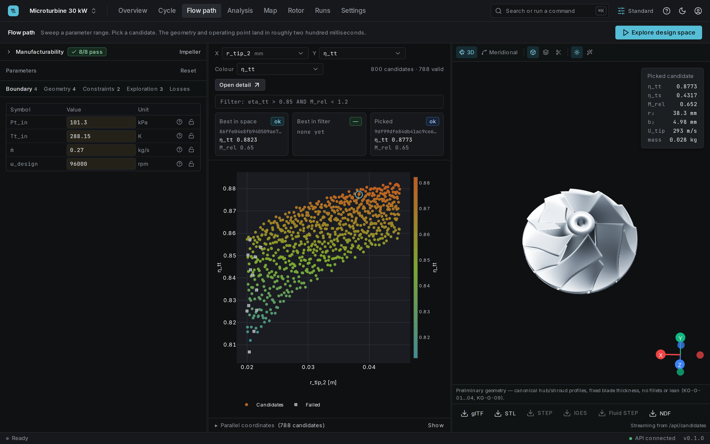
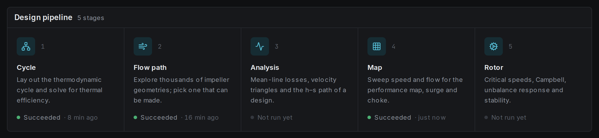
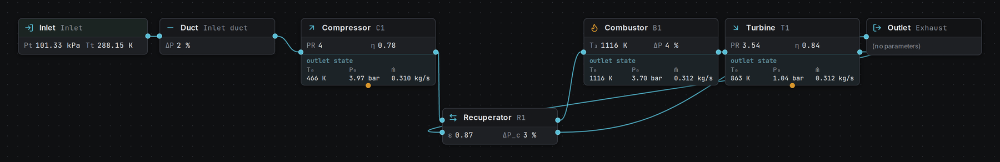
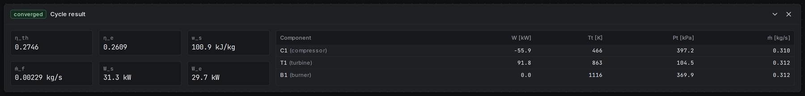
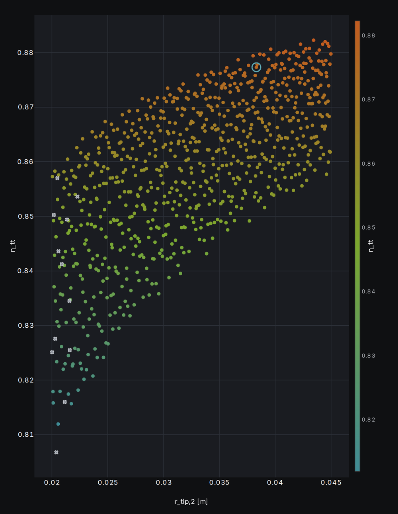
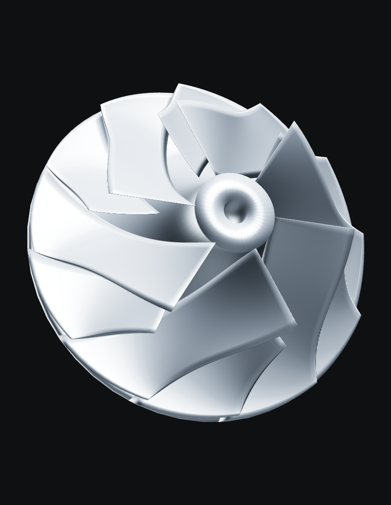
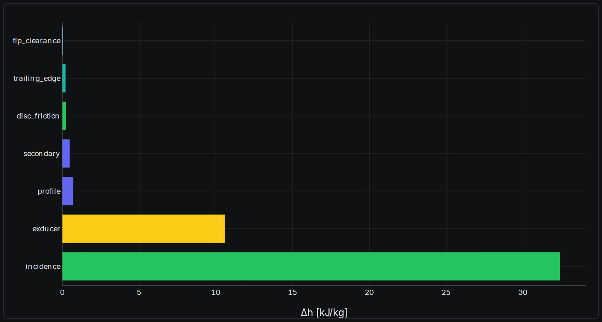
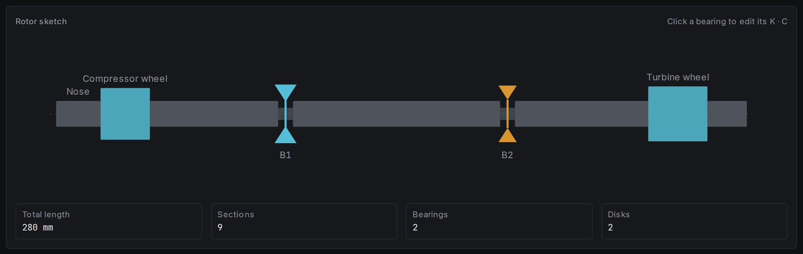
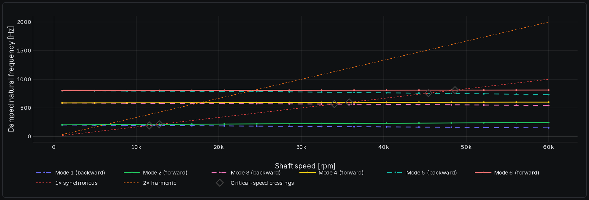

<div align="center">

# Cascade

**Design small gas turbines in your browser. Free and open source.**

[](LICENSE)
[](ROADMAP.md)
[](VALIDATION_REPORT.md)

</div>



## What is Cascade?

A **gas turbine** is an engine that sucks in air, squeezes it with a spinning **compressor**, burns fuel in it, and lets the hot gas push through a spinning **turbine**. The turbine drives the compressor and has power left over: to spin a generator, a propeller, or a pump. Jet engines and small power generators (like the 30 kW *microturbines* used in buildings) work this way.

Designing one means answering a chain of questions:

1. **Will the engine work, and how efficiently?** (the *cycle*)
2. **What shape should the spinning wheels be?** (the *flow path*)
3. **Where exactly is energy being lost?** (the *analysis*)
4. **How does it behave away from its ideal operating point?** (the *performance map*)
5. **Will the spinning shaft shake itself apart?** (the *rotor dynamics*)

Engineers normally answer these with several expensive desktop programs. **Cascade does all five in one place, in a web browser, for free.**

## How a design comes together

Every project walks through the same five stages. Each stage is a tab along the top of the app.



### 1 · Cycle: will the engine work?

Drag components onto a canvas (inlet, compressor, combustor, turbine, and so on) and connect them the way air flows through the engine. Press **Run cycle** and Cascade works out the temperature and pressure at every point, and how much of the fuel's energy becomes useful power.





*The built-in example, a 30 kW microturbine, comes out at 26% efficiency and 29.7 kW. That matches the published figures for the real machine it models.*

### 2 · Flow path: what shape should the wheel be?

A compressor wheel (the *impeller*) has dozens of dimensions: how wide, how many blades, how steep. Instead of guessing, press **Explore design space**. Cascade generates hundreds of possible wheels, scores each one, and plots them so you can see which designs perform best.

Click any dot to see that wheel in 3D. Cascade also checks whether a normal machine shop could actually cut it. Designs that can't be made are greyed out, with the reason shown.

<p>
  
  
</p>

*Left: each dot is one possible wheel. Higher means more efficient. Right: the circled design in 3D. You can download it as STL or glTF for CAD or 3D printing.*

### 3 · Analysis: where is energy lost?

No wheel is perfect. Air rubs, swirls and leaks, and each of those wastes a little energy. The analysis stage breaks the total loss into its causes, so you know what to improve first. Every loss formula comes from published engineering literature, and the source is cited.



### 4 · Map: how does it behave off-design?

Real engines don't always run at full speed. The performance map sweeps across speeds and flow rates to show where the compressor works well, and where it would *surge* (flow breaks down) or *choke* (it can't take any more air).

### 5 · Rotor: will the shaft shake?

Every spinning shaft has speeds at which it naturally vibrates, a bit like a guitar string. These are called *critical speeds*. If the engine runs near one, it can shake itself apart. Sketch the shaft with its wheels and bearings, and Cascade finds those danger speeds.





*The Campbell diagram: each flat line is one way the shaft can vibrate. Where it crosses a sloped "running speed" line (the diamonds), you have a critical speed to avoid or plan for.*

## Try it

You need **Python 3.12** and **Node.js 20+**. Then, from the repository folder:

```sh
make setup   # one time: installs everything
make run     # starts Cascade
```

Open **http://localhost:3000/projects** and pick **Microturbine 30 kW**. It's a complete, working example. Good first things to try:

- On **Cycle**, press **Run cycle**.
- On **Flow path**, press **Explore design space**, then click a dot.
- On **Rotor**, press **Critical-speed map**.

`make stop` shuts it down. New to turbines? The app has a **Learn** section: ten short illustrated chapters that start from zero.

## Can I trust the numbers?

Cascade is built to be checked, not taken on faith:

- **Every formula has a source.** Each loss model cites the paper or textbook it comes from, and an automated check fails the build if one doesn't.
- **Results are tested against real published cases.** For example, the microturbine example lands within 0.1 percentage points of the published efficiency of the Capstone C30 it models. The full list, including the cases that only pass with caveats, is in the [validation report](VALIDATION_REPORT.md).
- **It refuses instead of guessing.** If you ask for something outside what the models can handle, such as a combustor hotter than uncooled metal can survive, Cascade stops and tells you why. It won't hand you a number it can't stand behind.
- **Every known limitation is written down** in [KNOWN_GAPS.md](KNOWN_GAPS.md).

## What it can't do yet

Cascade v0.1 is aimed at **small, single-shaft machines**, like microturbines and small turbogenerators. Not yet supported:

- Large *axial* machines (the kind in airliner engines)
- Detailed matching of multi-shaft engines (simple multi-shaft cycles do work)
- Turbines with internal blade cooling
- Real-time collaboration (projects are plain text files, so teams share them through git today)
- Full 3D flow (CFD) and stress (FEA) simulation. Cascade hands off geometry to those tools instead.

What's coming next is in the [roadmap](ROADMAP.md).

## For developers

| | |
|---|---|
| **How it's built** | A Python 3.12 engineering core (`src/cascade/`), a FastAPI server (`apps/api/`), and a Next.js web app (`apps/web/`). The Python package also works on its own for scripting. |
| **Projects** | Each project is a folder of TOML text files with units, so it's easy to diff and review in a pull request. |
| **Useful commands** | `make test` (unit tests) · `make validation` (checks against published cases) · `make ci` (the full gate to run before opening a PR) |
| **Deep reference** | [SPEC_SHEET.md](SPEC_SHEET.md) is the full specification. In-app docs live at `/docs`. |

Contributions are welcome. The most valuable ones right now are digitising published test cases so the validation can get tighter. See the contributing section of the in-app docs (`/docs/contributing`).

## License

Free to use and self-host under [AGPL-3.0-or-later](LICENSE). Cascade is developed by [American Turbines](https://americanturbines.com/).
