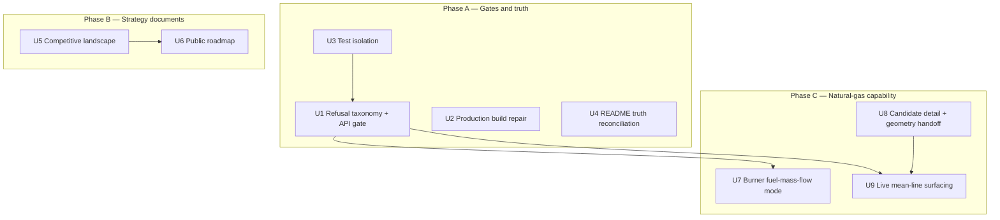
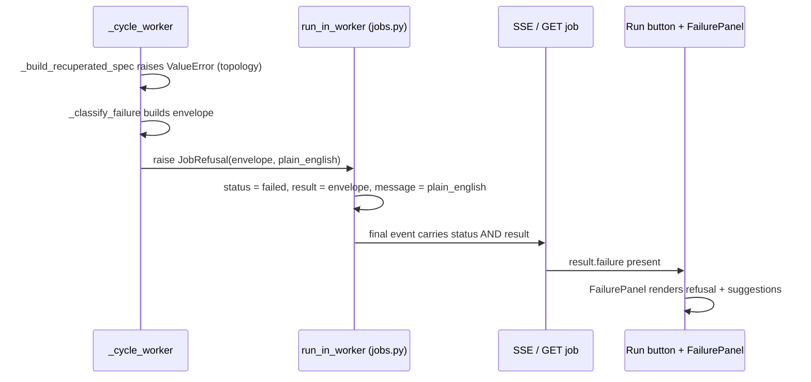
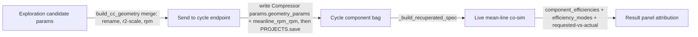

# feat: Small gas turbine release — gates, strategy docs, and natural-gas capability

## Summary

Harden Cascade v0.1.0 into a credible open-source flagship for small natural-gas turbine development: repair every broken quality gate from first principles, publish the competitive-landscape and roadmap documents that anchor the product strategy, and land three bounded capability units that close the gap between what the UI offers and what the solver delivers — fuel-mass-flow burner mode, a deep-linkable candidate detail page, and a working end-to-end live mean-line efficiency path.

## Problem Frame

Cascade's numerical core is real and validated (985 core tests + 130 validation pass-gates green), but the product around it has integrity gaps that undercut the "transparent, validated, reproducible" positioning:

- One API regression test fails (blank-project solve returns `done` with η=0 instead of a refusal), and `apps/api/tests/` sits outside every default test gate, so the failure is invisible.
- The production web build fails on lint errors — the app cannot deploy.
- Integration tests pollute the user-global `~/.cascade/projects/` directory.
- `README.md` claims a 1D thermal-fluid network and axial mean-line solvers that do not exist (KG-TFN-01, KG-AXT-01) — exactly the truth-in-advertising failure class the ADAPTATIONS review process exists to prevent.
- The Cycle page offers modes (`fuel_mass_flow`, `live_meanline`) that the core solver fully supports but that do nothing when picked, because the translation layer or a geometry writer is missing.
- The market-research and roadmap artifacts that should anchor an open-source launch live only as internal extraction notes; there is no public competitive analysis or roadmap.

External research confirms the opportunity is real: no open-source tool combines cycle analysis, radial mean-line design, performance maps, and rotor dynamics (the closest, TurboFlow, covers axial turbines only), and the dominant practitioner complaints about commercial tools — five-figure quote-only seats, dongles, no web access, opaque loss models — are precisely the axes Cascade already differentiates on.

---

## Requirements

**Strategy and truth**

- R1. A public competitive-landscape document exists covering the key commercial and open-source competitors, with per-product profiles (what it is, what makes it good, what users dislike, pricing/licensing signal), a table-stakes list for credibility with turbomachinery engineers, and an open-source gap analysis — every load-bearing claim carrying a source citation.
- R2. A public roadmap exists, positioned for small natural-gas turbine development, with every deferred capability anchored to a stable KG-ID in `KNOWN_GAPS.md`; no unshipped capability is described as shipped.
- R3. `README.md` matches the code: the thermal-fluid network and axial mean-line bullets move to the deferred section, the architecture section distinguishes what runs today from the deployment target, and no claimed artifact (TypeScript SDK, written theory docs) is presented as existing when it is not.

**Quality gates**

- R4. The full default test gate is green and includes `apps/api/tests/`: core suite, validation pass-gates, API tests, web unit tests, web typecheck, and the production web build all pass.
- R5. The blank-project refusal regression is fixed at root cause: solving a project whose canvas lacks required components yields job status `failed` with a plain-English message naming the actually-missing component kinds, while still carrying the structured failure envelope the UI's FailurePanel renders.
- R6. Test runs no longer write to `~/.cascade/projects/`; running the suite twice leaves the user-global directory unchanged.
- R7. All fixes are first-principles: no test is weakened, skipped, or special-cased to pass; production code contains no benchmark-name branches. A pinned test's contract may change only when the new contract is strictly more restrictive than the old one and the change is recorded as a new entry in `internal/ADAPTATIONS.md` citing the superseded doctrine — this is the only sanctioned exemption, and it is a rule, not a label.

**Natural-gas capability**

- R8. The Burner `fuel_mass_flow` spec mode works end-to-end: pick the mode in the UI, set a fuel flow, run, and see the back-derived TIT — with design-class refusals (not tracebacks) for degenerate inputs and a synchronous 422 on air-standard/pure-fluid projects where the mode cannot apply.
- R9. A picked design-exploration candidate has a deep-linkable detail page with geometry view, merged parameter table, objectives/constraints status, candidate-scoped manufacturability verdict, exports, and handoff actions — with designed states for unknown, expired, and stale candidates.
- R10. The live mean-line efficiency path is demonstrable end-to-end from the Cycle page: a candidate's geometry can be sent to the cycle compressor, the co-simulation runs, and the result panel attributes each rotor's η to its actual source (live mean-line, fixed isentropic, or fallback) — fallback is surfaced, never silent.

**Conventions**

- R11. The preview-badge convention is preserved: `wired: false` badges are removed only for fields that are now truly consumed by the solver; everything else keeps its badge.
- R12. The citations gate (`scripts/check_citations.py`) passes, and all new public documents follow `internal/BRAND_VOICE.md` with no authorship attribution.

---

## Key Technical Decisions

- **Refusal-vs-done job taxonomy (three classes, not two)** — (1) any run that produces no result — topology incomplete, invalid configuration, or a mid-solve refusal such as sub-atmospheric exhaust or a live-meanline regime refusal — maps to job status `failed` carrying the structured failure envelope; (2) a run that completes without converging stays `done` with `converged: false`; (3) an unexpected crash stays `failed` with `error` set and no envelope. The refusal signature is `error is None` + `result.failure` present. Implemented via a `JobRefusal` exception defined in `apps/api/jobs.py` (routers already import `jobs`; defining it in a router would invert the dependency), carrying the envelope, plain-English message, and a stable cause code (e.g. `MISSING_REQUIRED_COMPONENTS`) per the typed-exception convention; its `except` branch is ordered before the generic handler in `run_in_worker`. Rationale: the current worker returns the envelope as a normal result (hence `done`). The web client already handles failed-with-result — `streamJob` adapts `result` on any final event and the run button branches on `failure` presence before status — so the FailurePanel path needs no client change. Refusals write `last_run_status = "failed"` (an existing `adaptStatus` case; the legacy `non_converged`/`error` values encode design-vs-bug, not ran-vs-never-ran), and the worker sets+saves it before raising so `run_in_worker` stays project-agnostic.
- **Edges stay decorative in v1** — `_build_recuperated_spec` infers a fixed series topology from component kinds and never reads `project["edges"]`. A connectivity validator must understand recuperator dual-port wiring and risks breaking the three working seeds; it is deferred. The misleading "connect them with edges" suggestion copy is corrected in this branch.
- **Burner mode branches on `spec_mode`** — component PATCH is merge-only, so after one mode flip the params bag permanently holds both `outlet_temperature` and `fuel_mass_flow`, and the core Burner constructor raises unless exactly one is set. The spec builder gates on `spec_mode` (default `outlet_temperature`) and passes exactly one kwarg. Retaining the inactive value is intentional — flipping back restores it — and is pinned by a test.
- **Component PATCH becomes save-through** — today no component edit reaches disk until some unrelated worker calls `PROJECTS.save`, so whether user edits survive restart depends on which jobs happened to run. PATCH gains an explicit save, making persistence deterministic for the single-user TOML store. The side effect (a save flushes the whole cached project) is acceptable and documented in code.
- **Fuel-mode conflicts refuse synchronously** — `fuel_mass_flow` mode on air-standard or pure-fluid projects returns a 422 before job creation (mirroring the existing air-standard/live-meanline conflict check), and the UI disables the radio with an explanatory tooltip. Rationale: the core raises a constructor error mid-worker otherwise, which classifies as a software bug with traceback — wrong message for a user-input problem.
- **Candidate geometry handoff is the shared seam, written to one location** — the cycle live-meanline path already reads `efficiency_mode`, `geometry_params`, and `meanline_rpm_rpm` from the Compressor component (the bug ledger's B12 description is stale — the API plumbing shipped), but nothing in the product ever writes `geometry_params`. A "Send to cycle" action on the candidate detail page writes the merged geometry set plus `meanline_rpm_rpm` onto the Compressor component only. The merge is normative: produced by the same `build_cc_geometry(sample=candidate.params)` helper the explore/map routers use (it performs the key rename, r2-scaling of inducer dimensions, and yields the candidate's rpm) — hand-merging against unscaled defaults would trip the silent sanity clamp and run the co-sim on different geometry than the scatter point. Values are written as plain SI floats (candidate params already are). The write routes through an endpoint that calls `PROJECTS.save` — component PATCH mutates the cache without flushing, so an unsaved handoff would die on restart. A project-level mirror for the map path was considered and rejected: the project schema's `to_legacy_dict` silently drops a top-level `geometry_params` key (the mirror cannot persist), no API model exposes it, and the map worker's design-point constants and default grid are Eckardt-scale — candidate-scale geometry would make every default grid point choke. The map path is left unchanged this branch; "performance map follows the candidate" is deferred with its own gap entry.
- **Candidates are ephemeral; pins persist** — exploration candidates live in the in-memory index and die on restart. The detail page designs for this: an unknown/expired candidate renders a first-class "re-run exploration" state, and a "Pin as active candidate" action persists `settings.active_candidate_id` plus a params snapshot to the project TOML so pinned candidates survive restarts.
- **Live mean-line fallback is surfaced, not silent** — when geometry is absent, the solver's fallback to constant η stands (robustness), but the result payload's `efficiency_modes`/`component_efficiencies` are adapted into the web client and the result panel shows per-rotor attribution plus a warning when the user picked live mean-line and got a fallback. Because the builder overwrites the mode before the spec is built, the payload today records only the *actual* mode — the API gains a requested-vs-actual field (or explicit fallback flag) so the warning has a data source. Geometry that is attached but invalid refuses rather than falling back. This deliberately inverts the current behavior pinned by `test_build_compressor_geometry_returns_none_missing_required` and the in-code W-03 "graceful degradation" comment — that test changes as a documented contract change (not test-weakening), and the comment is updated so two contradictory doctrines don't coexist.
- **No axial mean-line or 1D network build in this branch** — KG-AXT-01 and KG-TFN-01 are multi-week solver builds with their own validation campaigns; attempting them inside this branch would violate the safety bar. They are the headline v1.1 roadmap items, and the README is corrected to stop claiming them.
- **Competitive document follows the house evidence standard** — per-claim source citations and severity scored against the named buyer persona (small NG-turbine developer), in the style of `internal/WEAKNESS_REGISTER.md`; it never presents an unshipped Cascade capability as shipped (the real-time co-edit retraction, ADAPT-015, is the cautionary precedent).

---

## High-Level Technical Design

Unit dependencies — Phase A is independent repair work; Phase C builds capability on the repaired contract:

Refusal job contract (U1) — the worker currently catches the topology `ValueError` and returns the failure envelope as a normal result, so the job completes `done`. The fix routes refusals through a dedicated exception that preserves the envelope:

Geometry handoff data flow (U8 → U9) — one writer, one canonical location:

---

## Implementation Units

### U1. Refusal job taxonomy and API test gate

- **Goal:** Blank or incomplete cycle projects refuse with job status `failed`, a plain-English message naming the actually-missing component kinds, and the structured failure envelope intact; `apps/api/tests/` joins the default test gate.
- **Requirements:** R4, R5, R7
- **Dependencies:** U3 (the API tests write to the user-global store until the isolation fixture exists — the gate must not include unisolated tests)
- **Files:** `apps/api/jobs.py`, `apps/api/routers/cycle.py`, `apps/api/tests/test_cycle_field_patches.py` (must pass unmodified), new `apps/api/tests/test_job_refusal_contract.py`, `apps/web/src/lib/api/client.ts`, `apps/web/src/components/cycle/run-button.tsx`, `Makefile`, `pyproject.toml`
- **Approach:** Define `JobRefusal` in `apps/api/jobs.py` carrying the failure envelope, plain-English message, and a stable cause code; its `except` branch goes before the generic `except Exception` in `run_in_worker`, unwrapping into `status="failed"`, `job.result = envelope`, `job.message`, `error = None` — and mirroring the `job.cancelled` guard the success path has, so a refusal raised after cancellation does not publish a second final event. `_cycle_worker` raises it for every no-result run: topology refusals, mid-solve refusals, and the caught-and-classified bug-kind envelopes (which keep their `bug_log`; the design-vs-bug split lives inside the envelope's `kind`). Class 3 (crash with `error` set, no envelope) covers only exceptions escaping the worker's classify scaffolding. Class 2 (`done` + `converged: false`) retains its failure envelope — the refusal signature `error is None` + `result.failure` applies only within `status == "failed"`. The missing-components message enumerates only the kinds actually absent (`_component_by_kind` already knows). Correct the "connect them with edges" suggestion copy, and add a small canvas/properties disclosure that v1 infers a series flow path from component kinds (edges are illustrative — cite the connectivity KG-ID from U6). `last_run_status` is written directly by the worker (not via `_failure_result`, which writes `non_converged`): `"failed"` on refusal — and `PROJECTS.save()` runs on all terminal cycle paths (`done`, `non_converged`, `failed`) so success badges survive restart too, not just refusals. Gate mechanics: both `tests/` and `apps/api/tests/` contain an `__init__.py` package named `tests`, so adding the API tests to root `testpaths` breaks collection (`ModuleNotFoundError`) — run them as a second pytest invocation in `make test` instead, consistent with `apps/api/pyproject.toml`'s own `testpaths`. The web client needs no FailurePanel change (`streamJob` already adapts `result` on any final event; the run button branches on `failure` presence before status) — U1's web-side scope is regression tests plus updating the now-stale contract comment in `run-button.tsx` (it documents the old always-`succeeded` behavior).
- **Test scenarios:**
  - Empty canvas (aero-demonstrator seed): solve → job `failed`, message contains "Compressor", "Burner", "Turbine", `result.failure.kind == "design"`, `error is None`.
  - Partial canvas (Compressor + Turbine, no Burner): message names only "Burner".
  - Components present, zero edges: solves successfully (edges decorative — pins KTD), and no suggestion text mentions connecting edges on the missing-components refusal.
  - Valid canvas (microturbine seed): unchanged — `done`, converged, documented η ≈ 27%.
  - Non-convergence (extreme but structurally valid inputs that still produce a result): stays `done` with `converged: false` — pins class 2 of the taxonomy.
  - Mid-solve refusal (e.g. sub-atmospheric exhaust): `failed` with envelope — pins class 1's mid-solve arm.
  - Non-converged `done` job still carries its failure envelope and is not treated as a refusal — pins the signature scoping.
  - Refusal-vs-crash signature: refusal has `error is None` + `result.failure` present; an injected unexpected exception has `error` set and no envelope. The class-3 injection must land outside the worker's classify path (e.g. patch the project-store lookup) — anything raised inside `solve_cycle` gets classified into a bug-kind envelope and is class 1.
  - Cancel-then-refuse race: a job cancelled before the refusal raises keeps status `cancelled` and publishes no second final event.
  - `last_run_status` for a refused run is `"failed"` and survives a `PROJECTS.reload()`; a converged run's `"done"` badge also survives reload (terminal-path save symmetry).
  - Existing `test_three_seed_projects_match_documented_eta` passes without modification.
- **Verification:** `make test` runs and passes including `apps/api/tests/`; manual run in the UI shows the FailurePanel (not a raw-error toast) on a blank project.

### U2. Production web build repair

- **Goal:** `npm run build` succeeds; the build joins the verification gate.
- **Requirements:** R4, R7
- **Dependencies:** none
- **Files:** `apps/web/eslint.config.mjs` (or `.eslintrc.*` as found), `apps/web/src/__tests__/_filter_dsl_stripped.mjs`, `apps/web/src/app/docs/validation/page.tsx`, `Makefile`
- **Approach:** The stripped test artifact is build tooling, not application code — exclude it from lint (ignore pattern) rather than mangling it. Fix the `react/no-unescaped-entities` error in the validation page by escaping the offending characters. Add a build (or `lint` + `build`) target to the Makefile gate so regressions surface. Fix forward, not by disabling rules globally.
- **Test scenarios:** Test expectation: none — build configuration; the gate itself is the test (`npm run build` exit 0, existing 20 web unit tests stay green).
- **Verification:** `npm run build` exits 0; `npx tsc --noEmit` stays clean.

### U3. Test isolation for project storage

- **Goal:** No test run writes to the user-global `~/.cascade/projects/`.
- **Requirements:** R4, R6, R7
- **Dependencies:** none
- **Files:** new `apps/api/tests/conftest.py` (none exists today), `tests/` integration conftest(s) as found, `src/cascade/project/persistence.py` (audit target — the path binding lives here, not in `jobs.py`)
- **Approach:** Autouse fixture sets `CASCADE_PROJECTS_DIR` to a per-session `tmp_path`. The binding site is `projects_dir()` in `src/cascade/project/persistence.py`, which resolves per call (late-bound) — so the fixture approach works without production changes; verify no other module captures the path at import. Do not change production default behavior.
- **Test scenarios:**
  - Meta-test: after a representative API integration test, `~/.cascade/projects/` mtime/content is unchanged (assert via fixture snapshot).
  - Seed projects still appear in the isolated dir, and tests that reload projects still pass.
- **Verification:** Run the full suite twice; `ls ~/.cascade/projects | wc -l` identical before and after.

### U4. README truth reconciliation

- **Goal:** Every capability claim in `README.md` matches shipped code.
- **Requirements:** R3, R7, R12
- **Dependencies:** none
- **Files:** `README.md`, `src/cascade/cycle/components.py` (warning copy — the "geographically uncommon" string lives here, not in `solver.py`), `KNOWN_GAPS.md` (cross-reference only if IDs need updating)
- **Approach:** Audit every claim in `README.md`, not only "What's in v1": move the 1D thermal-fluid network and axial mean-line bullets to the deferred section with their KG-IDs; split the architecture section into "running today" (FastAPI + in-memory/TOML, ThreadPool jobs, single-user) vs "deployment target" (PostgreSQL, Celery/Redis, Fly.io); remove or mark planned the TypeScript SDK and written theory docs under `docs/` (the learn content lives in the web app); and fix the "Self-serve — transparent pricing, free starter tier" bullet, which describes a hosted business model that does not exist — reframe to what is true today (AGPL self-host, free; hosted instance on the roadmap). Walk the demo-recording script against the running app and soften any step it cannot deliver. Fix the "geographically uncommon" warning copy (grep first to confirm no test asserts the string). Keep the tone per `internal/BRAND_VOICE.md`.
- **Test scenarios:** Test expectation: none — documentation and copy; the citation gate and full suite must stay green (the warning-copy change is the only code touch).
- **Verification:** A reviewer can trace every README claim — capability bullets, hero bullets, demo script, architecture — to shipped code or an explicit "planned" marker; `make check-citations` passes.

### U5. Competitive landscape document

- **Goal:** A public, evidence-cited competitive analysis of the turbomachinery design software market, positioned for the small natural-gas turbine developer.
- **Requirements:** R1, R12
- **Dependencies:** none
- **Files:** new `docs/research/competitive-landscape.md`
- **Approach:** Synthesize the internal dossiers (`internal/COMPETITOR_PROFILE.md`, `internal/WEAKNESS_REGISTER.md`, `internal/DIFFERENTIATION_PLAN.md`) with the external landscape findings. Per-product profiles: SoftInWay AxSTREAM (incl. 2025 Power Tokens licensing shift), Concepts NREC Agile suite, CFturbo, ADT TURBOdesign, the Ansys toolchain (with the recovered price points: CFD Premium ≈ $58k/4-core + maintenance), cycle tools (GasTurb, GSP, NPSS/pyCycle, Thermoflow, EcosimPro/PROOSIS), and open-source alternatives (TurboFlow, MULTALL, SU2, MISES, CAESES). Each profile: what it is, what makes it good, what users dislike, pricing/licensing signal, sources. Cross-cutting sections: table stakes for credibility (published-case validation, citable loss models, API 617/684 rotor outputs, STEP/IGES + geomTurbo/TurboGrid export, real-gas EOS, SI/US units, standard map conventions); common complaints (cost, dongles, no web/collaboration, opaque models); the open-source gap table; and where Cascade stands honestly against each table-stake today (shipped vs deferred with KG-IDs). House style with three hard rules beyond the evidence standard: (1) public sources only — claims sourced solely from the private sales-demo recording in the internal dossiers are re-grounded in public evidence or excluded (a company-branded public document cannot cite a private demo, and demo-derived competitor criticism carries confidentiality exposure); (2) pricing claims use dated, hedged phrasing ("publicly reported at ≈ $X as of [date], per [source]") — vendor pricing is volatile and quote-dependent; (3) no unshipped Cascade capability presented as shipped. Note: SoftInWay's Power Tokens program dates to November 2024 per the internal dossier — verify dates against sources rather than trusting this plan's prose. No authorship attribution.
- **Test scenarios:** Test expectation: none — documentation deliverable; review check is the per-claim citation rule.
- **Verification:** Spot-check ten claims against their cited sources; confirm no claim about Cascade contradicts `KNOWN_GAPS.md`.

### U6. Public roadmap

- **Goal:** A public `ROADMAP.md` that tells a small-NG-turbine developer exactly what Cascade does today, what comes next, and why.
- **Requirements:** R2, R12
- **Dependencies:** U5 (cites the landscape document's table-stakes analysis)
- **Files:** new `ROADMAP.md`, `README.md` (one link line)
- **Approach:** Open with an honest served-segment statement: today Cascade serves single-shaft radial machines in the microturbine class (recuperated Brayton + radial inflow turbine + centrifugal compressor); axial and multi-spool small gas turbines (the 1-20 MW end of "small") are the v1.1 trajectory — the headline never claims the whole segment while the solvers cover its radial end. Operationalize "industry-leading" by naming which of U5's table stakes this release clears (citable loss models, published validation, API 617/684-aligned rotor outputs, real-gas EOS, units, TurboGrid export) and which remain open, so future scope debates have a referee. Three horizons. Now (this release, written in forward tense — "landing in this release" — with a merge-time pass to confirm tense matches what actually shipped): the gate repairs and capability units in this plan. Next (v1.1): axial mean-line (KG-AXT-01), 1D thermal-fluid network (KG-TFN-01), multi-spool matching (KG-003), cooled turbine (KG-004), foil/tilt-pad bearing solvers (KG-007/KG-009 — foil bearings called out for the Capstone-class microturbine persona), off-design mean-line choke/surge (KG-ML-06), real-gas-to-mean-line plumbing (KG-ML-07), validation coverage debt (KG-ML-09/10), performance-map candidate-geometry derivation (new KG-ID, from U8's deferral), canvas edge-connectivity semantics (new KG-ID, cited by U1's disclosure copy), and a hosted instance (new KG-ID — the "hosted by American Turbines" workstream's durable home; AGPL self-host is the offer today). Later (adapter strategy): CFD via OpenFOAM stub, 3D FEA via CalculiX, per `SPEC_SHEET.md` §2. Every item carries its KG-ID; nothing unshipped is described in present tense. Includes the positioning statement for natural-gas small turbines and the explicit not-doing list (3D RANS in-core, heavy FEA, manufacturing CAM).
- **Test scenarios:** Test expectation: none — documentation deliverable.
- **Verification:** Every roadmap item resolves to a KG-ID or SPEC section; README links to it.

### U7. Burner fuel-mass-flow mode end-to-end

- **Goal:** Picking "fuel mass flow" on a Burner does what it says: the solver back-derives TIT from ṁ_fuel, the UI shows the derived TIT, and degenerate inputs refuse with design-class messages.
- **Requirements:** R8, R11, R7
- **Dependencies:** U1 (refusal taxonomy and envelope contract)
- **Files:** `apps/api/routers/cycle.py`, `apps/api/routers/components.py` (save-through PATCH), `apps/web/src/components/cycle/properties-panel.tsx`, `apps/web/src/lib/api/client.ts`, `apps/web/src/components/cycle/result-panel.tsx`, new `apps/api/tests/test_burner_fuel_mode.py`
- **Approach:** Spec builder branches on `bp.get("spec_mode", "outlet_temperature")` and passes exactly one of `outlet_temperature` / `fuel_mass_flow` to the Burner. Degenerate bags (`spec_mode == "fuel_mass_flow"` with no value, or value ≤ 0/NaN) refuse design-class, not traceback. Synchronous 422 when the mode is picked on air-standard/pure-fluid projects, mirroring the existing live-meanline conflict check; the UI disables the radio on such projects with an explanatory tooltip ("Fuel mass-flow mode requires a combustion working fluid") that fires on hover and keyboard focus (wrap the disabled input so it remains focusable/discoverable). Persistence: component PATCH becomes save-through — `update_component` calls `PROJECTS.save(project_id)` after mutating. Today persistence is incidental (edits reach disk only when some job's worker happens to call save), which makes the TOML round-trip scenario below impossible and means user edits survive restart only by luck; save-through fixes the class. Known side effect to document in code: any save flushes the whole cached project. UI: remove the warn-on-pick toast and the `wired: false` badge for this field only; promote the fuel-flow field into essentials when the mode is active (dynamic section membership — not auto-expanding Advanced); the mode-inactive field stays visible but disabled using the `text.disabled` token with a tooltip naming which mode activates it — not a preview badge, which means "not wired" and would be semantically wrong here; seed a kind-typical default (~0.002 kg/s, the C30-class flow) with zod `gt(0)`. Result display: the canvas T₃ chip shows the back-derived TIT with the computed-value tint and a "(derived)" label in fuel-ṁ mode — never the stale `outlet_temperature_K`; while a run is in flight the chip greys its previous value; the result panel labels TIT "(derived)".
- **Test scenarios:**
  - Params-bag matrix (API-level, against microturbine seed): TIT only; fuel only; both + `spec_mode=outlet_temperature`; both + `spec_mode=fuel_mass_flow`; `spec_mode=fuel_mass_flow` with no fuel key (design-class refusal); fuel = 0 (refusal, not ZeroDivision); fuel high enough that derived TIT > 2100 K (`RegimeOutOfValidity`, design-class, suggestion mentions reducing fuel flow); air-standard project + fuel mode (synchronous 422).
  - Mode round-trip: set fuel mode and value, run (TIT derived); flip back to TIT mode, run (original behavior restored from retained value) — pins the merge-retention KTD.
  - Unit conversion: PATCH `{"value": 2.3, "unit": "g/s"}` resolves correctly.
  - TOML persistence: PATCH `spec_mode` + `fuel_mass_flow` → `PROJECTS.reload()` → both survive, solve branches correctly.
  - Existing `test_burner_wired_fields_change_eta` (default-mode inference) stays green.
  - Dirty-state guard: mode flip without save → Run warns, solver uses the saved mode (web unit test if the harness reaches it; otherwise assert the store wiring in the node-script tests).
- **Verification:** In the UI: pick fuel mode on the microturbine project, set 0.0023 kg/s, run, observe derived TIT ≈ the documented C30 solve; η changes when fuel flow changes.

### U8. Candidate detail route and geometry handoff

- **Goal:** A deep-linkable `/projects/[id]/flowpath/[candidateId]` page for one exploration candidate, and the product's first writer for cycle-component geometry.
- **Requirements:** R9, R7
- **Dependencies:** none (U9 depends on this)
- **Files:** new `apps/web/src/app/projects/[id]/flowpath/[candidateId]/page.tsx` and components, `apps/web/src/components/flowpath/impeller-viewer.tsx` (prop-driven variant), `apps/web/src/components/flowpath/design-scatter.tsx` (Open-detail affordance), `apps/web/src/app/projects/[id]/runs/page.tsx` (link via explore `best_id`), `apps/api/routers/manufacturability.py` (add a `candidate_id` query parameter — none exists today; the field on the response model is an output echo, not an input), `apps/api/routers/candidates.py` (handoff/pin endpoints as needed), `apps/api/models.py` (expose `project_id` on `CandidateModel` — the in-memory dicts carry it but the API model does not, and the cross-project guard needs it), `apps/web/src/lib/api/client.ts` (real-client `listRuns` plus handoff/pin calls; the mock-client variant keeps mock data as the offline fallback), new `apps/api/tests/test_candidate_handoff.py`
- **Approach:** Page is self-sufficient from the URL — fetches candidate, geometry, and manufacturability by id; never assumes a warm client store. Single click on the scatter keeps preview-in-place; an explicit "Open detail" affordance navigates; arriving by URL sets `pickedCandidateId` so back-navigation highlights the dot. States: unknown id → designed not-found with CTA back to `/flowpath`; candidate from a non-latest exploration job → provenance label ("from exploration job X") with stale flag; restart-expired → first-class "re-run exploration" state. Guard cross-project mismatch: `candidate.project_id` must match the route, else not-found. Content: prop-driven 3D viewer (stub-mesh header handling preserved), merged-with-defaults parameter table (the geometry set actually used, not just the 3 sampled params), objectives/constraints with status chip (non-VALID candidates get a distinct layout; the `M_rel: 9.99` sentinel never renders as a real number), candidate-scoped manufacturability verdict, export strip. Handoffs: "Send to cycle" is a save-through endpoint that serializes the `build_cc_geometry(sample=candidate.params)` result — the helper returns a geometry object plus an operating-point dict, so the endpoint extracts the geometry fields to a plain-SI-float dict (the field names match what the cycle builder expects) and takes `meanline_rpm_rpm` from the operating point's rpm — and **replaces** the Compressor's `geometry_params` subtree wholesale (not key-merge: under U9's refusal contract a stale partial bag would otherwise be permanently poisoned with no documented escape). No project-level mirror (see KTD). The endpoint refuses with a synchronous 422 when the project's canvas has no Compressor component (the blank seed can legitimately host candidates), and the UI disables the action with that reason. Because explore candidates are built at a conservative reference tip speed (PR ≈ 1.8) while the seed cycles impose higher pressure ratios, geometry+rpm alone would run the co-sim deep off-design — so the handoff also offers a default-on, user-confirmable alignment step that sets the cycle's compressor `pressure_ratio` and boundary-condition mass flow to the candidate's design point; without alignment, a live-meanline refusal is the expected and honest outcome. UI states for the handoff: confirmation before overwriting non-empty geometry, loading state in flight, success toast ("Compressor geometry updated — open Cycle"), error toast on failure. "Pin as active candidate" persists `settings.active_candidate_id` + params snapshot to TOML; mode-switch back to fixed-isentropic is the sanctioned escape hatch for detaching geometry behavior, and a small "detach geometry" action removes the bag entirely. Sequencing within the unit: land the handoff endpoint plus a "Send to cycle" button on the existing scatter preview first (U9's only true dependency), then the detail page. Wire the real-client `listRuns` to `GET /api/jobs?project_id` (it returns mock seed data today) with done/failed status adaptation, so the runs page can link explore jobs to their best candidate. View-mode tab state in query params.
- **Design notes:** Layout: the 3D viewer keeps the flowpath page's right-pane column; the main area is a scrollable detail sheet ordered provenance → objectives/constraints status → merged parameter table → manufacturability → exports, with "Send to cycle" and "Pin" as sticky actions at the top. Engineering density per the design system: 24 px dense table rows, monospace numerics, compact tabular objectives (not status cards) — the page must not read as a generic SaaS detail view. Non-VALID candidates: status chip with icon + text (never color alone), sentinel values render as "—" with a tooltip (never as numbers), geometry/export sections suppressed, handoff actions disabled with the reason. Stale candidates: warning-tinted chip inline with the provenance label, distinct from the full-page expired state. Accessibility: "Open detail" is a focusable labeled button (not a Plotly canvas click target); on navigation, focus moves to the page heading.
- **Test scenarios:**
  - Handoff (API): after "send to cycle", the Compressor bag holds the full merged geometry key set + rpm as plain SI floats; values reflect `build_cc_geometry`'s renamed/scaled output, not bare sampled params.
  - Handoff replace semantics: re-sending over a bag holding stale extra keys leaves only the new candidate's keys (pins replace-not-merge).
  - Handoff with alignment confirmed: compressor `pressure_ratio` and BC mass flow match the candidate's design point; without alignment, the original cycle values are untouched.
  - Handoff on a project with no Compressor component: synchronous 422 design-class refusal.
  - Handoff reload-survival: send to cycle → `PROJECTS.reload()` → geometry and rpm survive (pins the save-through requirement).
  - Manufacturability with `candidate_id` param returns the routed candidate's verdict, not the active-candidate fallback.
  - Pin persistence: pin → `PROJECTS.reload()` → `active_candidate_id` + snapshot survive.
  - Unknown candidate id → 404 from `GET /api/candidates/{cid}` → page renders the not-found state (adapter-level node-script test for the state mapping).
  - Cross-project id (candidate from project A on project B's route) → not-found.
  - Stale candidate (older job, still resolvable) → provenance label rendered.
  - Runs list (API + adapter): `listRuns` returns real jobs for the project; a refused cycle run appears with a failed badge; an explore job exposes its `best_id` for the candidate link.
- **Verification:** Run an exploration, open a candidate detail via the scatter and via pasted URL in a fresh tab; both render identically; "Send to cycle" then U9's flow works.

### U9. Live mean-line surfacing and attribution

- **Goal:** The live mean-line co-simulation is usable and honest from the Cycle page: geometry arrives via U8's handoff, the result panel attributes every rotor η to its source, and fallback is visible.
- **Requirements:** R10, R11, R7
- **Dependencies:** U1 (failure taxonomy), U8 (geometry writer)
- **Files:** `apps/web/src/lib/api/types.ts`, `apps/web/src/lib/api/client.ts` (`adaptCycleResult`), `apps/web/src/components/cycle/result-panel.tsx`, `apps/web/src/components/cycle/properties-panel.tsx` (conditional mode messaging), `apps/web/src/app/projects/[id]/map/page.tsx` (provenance label), `apps/api/routers/cycle.py` (attached-but-invalid refusal in both rotor builders; requested-vs-actual payload field; W-03 comment updates), `tests/integration/test_cycle_cosim.py` (both pinned fallback tests — deliberate contract change, see approach), `internal/ADAPTATIONS.md` (new entry recording the doctrine change), new `apps/api/tests/test_live_meanline_cycle_page.py`
- **Approach:** Adapt `component_efficiencies` and `efficiency_modes` from the result payload into the web client (both currently dropped). The builder overwrites the mode before the spec is built, so the payload records only the actual mode — add a requested-vs-actual field (or explicit fallback flag) on the API side; without it the warning state has no data source. Result panel: an "Efficiency sources" block, shown when live mean-line was requested or a fallback occurred, with per-rotor rows — "η = 0.81 (live mean-line)" vs "(isentropic)" — and, on fallback, a warning chip with icon plus copy ("Fell back to isentropic — no geometry attached"); never color alone. API: geometry attached but invalid → design-class refusal (not silent fallback); geometry absent → fallback allowed but flagged. The inversion applies only to the missing-required-fields branch of the geometry builders — the unknown-unit path already raises and needs no refactor — and applies **symmetrically to both rotor builders**: the turbine builder carries the identical silent fallback and its own pinned test, and an asymmetric contract would show refusal semantics on one rotor and silent fallback on the other. Update both pinned tests as a documented doctrine change (refusal-over-guess, SPEC §13), not a weakening; record the change as a new `internal/ADAPTATIONS.md` entry citing the superseded W-03 doctrine (the R7 exemption rule), and update the W-03 "graceful degradation is a hard requirement" comments so the two doctrines don't coexist. The in-worker unknown-unit path (an HTTPException raised inside the builder during a job run) classifies as design-class, not a bug traceback. Properties panel: replace the warn-on-pick toast with conditional messaging — when no geometry is attached, an inline info note below the mode radio pointing at the candidate-detail handoff; when attached, a read-only chip indicating geometry is attached (with source candidate when pinned). Performance-map honesty: the map page gains a one-line provenance label ("computed from reference geometry — candidate geometry handoff lands later, KG-ID") so a user who just sent a candidate to the cycle does not read the Eckardt-scale map as their machine's map. Verify the 422 conflict (air-standard + live mean-line) renders `detail.message` in the UI, not `[object Object]`.
- **Test scenarios:**
  - Geometry attached at design point: cycle converges; compressor η differs from the constant-η run; `efficiency_modes` reports `live_meanline`; result payload carries per-component η.
  - Geometry far off-design: refusal classified design-class (`LIVE_MEANLINE_REGIME_REFUSED`), envelope carries suggestions — and per U1's three-class taxonomy this no-result run ends `failed` with envelope.
  - Mode selected, no geometry: solve completes; payload carries requested = `live_meanline`, actual = `constant` (the fallback flag); adapter exposes it; result panel test (node-script) asserts the warning state mapping.
  - Geometry attached but missing a required key: design-class refusal naming the key, not a traceback (updated `test_build_compressor_geometry_returns_none_missing_required` pins the new contract).
  - Turbine-side symmetry: the turbine builder refuses on attached-but-invalid geometry identically (its pinned fallback test updated the same way).
  - Unknown unit inside an attached geometry dict during a worker run: design-class refusal, not a bug-class traceback.
  - Mode flip back to isentropic: solve matches the original constant-η result; `geometry_params` retained in the bag (pins the merge KTD).
  - Recuperated + live mean-line (the documented hard case): either converges or refuses with the outer-nonconvergence classification — never hangs past the iteration cap.
- **Verification:** Full demo flow: explore → open candidate → send to cycle **with alignment confirmed** → pick live mean-line → run → result panel shows live-meanline-attributed η consistent with the candidate's scatter value at its rpm and design point. Without alignment, the expected outcome is a design-class refusal with an actionable envelope — that is the honest result, not a failure of the unit.

---

## Acceptance Examples

- AE1. Given the blank aero-demonstrator seed, when the user clicks Run cycle, then the job ends `failed` and the FailurePanel shows "missing required components" naming Compressor, Burner, and Turbine. (The runs-history failed badge depends on U8's `listRuns` wiring — the runs page renders mock data today.)
- AE2. Given the microturbine seed with extreme-but-valid inputs that prevent convergence but still produce a result, when the user runs, then the job ends `done` with `converged: false` — non-convergence is not a refusal.
- AE3. Given a Burner in fuel-mass-flow mode with ṁ_fuel = 0.0023 kg/s on the microturbine project, when the user runs, then the result shows a derived TIT and the canvas chip does not display the stale outlet-temperature value.
- AE4. Given live mean-line mode selected with no geometry attached, when the user runs, then the solve completes with constant η and the result panel visibly states the fallback — never an unlabeled isentropic number.
- AE5. Given a candidate URL pasted into a fresh browser session after a server restart, when the page loads, then the user sees the designed "candidate expired — re-run exploration" state, not an error boundary.

---

## Scope Boundaries

**In scope:** everything in the Implementation Units above, on a feature branch of this repository.

### Deferred to Follow-Up Work

- Axial mean-line solvers (KG-AXT-01) and the 1D thermal-fluid network (KG-TFN-01) — headline v1.1 roadmap items with their own validation campaigns.
- Canvas edge-connectivity validation (recuperator dual-port aware) — edges stay decorative in v1; copy corrected here.
- Performance map follows the candidate: re-pointing the map path to component-level geometry requires candidate-scaled grid and design-point derivation (today's Eckardt-scale defaults would choke on microturbine-scale geometry) — gets its own KG-ID in the roadmap.
- Intercooler/Mixer/Splitter solver consumption (B14 verdict stands: preview-badged), `polytropic` efficiency mode (B11), Mixer port-count rendering (B20).
- Python venv 3.9→3.12 alignment (unblocks `cascade[cad]`/OCC suite) — environment change too risky mid-branch; documented in the roadmap.
- Auth, PostgreSQL/Celery deployment, TypeScript SDK, real-time co-edit (KG-PLAT-01) — architecture-target items.
- Frontend E2E harness (Playwright) — this branch extends the node-script tests and API-level coverage only.
- Validation coverage debt: RIT-3/4, CC-3/4/5 test files (KG-ML-09/10) — requires source-paper digitization, not safe to improvise.

### Outside this product's identity

- Native 3D RANS CFD, full 3D FEA, CAM/5-axis manufacturing output — adapter contracts only, per `SPEC_SHEET.md` §2 and the differentiation plan's explicit not-doing list.

---

## Assumptions

- "Create a branch of Cascade" means a git feature branch in this repository: Cascade is already the American Turbines product, so no fork, rename, or rebranding is implied.
- "Hosted by American Turbines" is interpreted as repository stewardship and public documentation under the American Turbines name for this branch; a live hosted instance is a deferred roadmap item with its own KG-ID (see U6), not silent scope.
- The positioning shift this implies: the AGPL community edition (free, self-hosted) is the offer today; the internal "self-serve pricing — MUST SHIP v1" differentiator (D9 in `internal/DIFFERENTIATION_PLAN.md`) transforms into hosted-instance freemium on top of the AGPL core, deferred with the hosted instance. U5/U6 write the public story accordingly, and `internal/PRODUCT_NAME_AND_POSITIONING.md` gets a one-line supersession note so internal doctrine and public docs do not diverge.
- The competitive landscape document is public-facing (`docs/research/`), consistent with the transparency positioning; the internal dossiers remain internal.
- License remains AGPL-3.0-or-later; no licensing changes are in scope.
- All public documents and commit messages follow `internal/BRAND_VOICE.md` and carry no authorship or tooling attribution.
- The 34 OCC-gated skips and the SPEC-7 xfail are expected-by-design and remain; "every unit test passes" means zero failures, not zero skips.

---

## Risks & Dependencies

- **Job-contract change blast radius** — `run_in_worker` is shared by explore/map/rotor workers. The refusal exception is opt-in (only raised by the cycle worker initially), so other workers are unaffected; the U1 test suite pins the unchanged paths.
- **SSE/UI contract drift** — the web client already adapts `result` on any final event and branches on `failure` presence, so failed-with-result should render without client changes; the U1 regression scenarios pin this rather than assuming it. Manual UI verification is still required because frontend automation is thin (two node-script tests).
- **Geometry handoff correctness** — candidates carry only 3 sampled params; the handoff must go through `build_cc_geometry(sample=...)` (key rename, r2-scaling, candidate rpm), or the cycle co-sim runs different geometry than the scatter point shows (user-visible inconsistency). U8's merged-geometry test pins this.
- **Lint repair scope creep** — fixing the two build errors may surface further lint findings; the unit fixes forward (escape, ignore tooling artifacts) and must not disable rules globally.
- **Scale** — nine units is a large branch delivered as one PR by the pipeline. The dependency order (U3 → U1 → rest of A → B → C) front-loads the gates, and commits land phase-ordered so Phase A's repairs are cherry-pickable if the full PR stalls in review. The highest-dispute units (the U9 contract inversion, U5's citation standard) sit last for the same reason.

---

## Sources & Research

- Internal: `KNOWN_GAPS.md`, `SPEC_SHEET.md` §2/§12/§13, `VALIDATION_REPORT.md`, `internal/CYCLE_PAGE_BUG_LEDGER.md` (B10/B12/B14 ground truth), `internal/ADAPTATIONS.md` (severity taxonomy and prioritization order), `internal/WEAKNESS_REGISTER.md` + `internal/DIFFERENTIATION_PLAN.md` (competitive house style), `internal/WEB_APP_PLAN.md` (route map, candidate-detail intent), `internal/BRAND_VOICE.md`.
- Code ground truth: `apps/api/routers/cycle.py` (`_build_recuperated_spec`, `_classify_failure`, live-meanline plumbing already merged), `apps/api/jobs.py` (`run_in_worker`, in-memory candidate index), `src/cascade/cycle/components.py` (Burner XOR contract, 2100 K refusal), `apps/web/src/components/cycle/properties-panel.tsx` (wired-flag and preview-badge conventions).
- External landscape (feeds U5): Concepts NREC product pages and 2025 Fidelity release coverage; CFturbo interfaces documentation; ADT TURBOdesign 2025.x releases; Ansys toolchain pricing signals (Ozen blog); GasTurb/GSP/NPSS/Thermoflow/PROOSIS licensing pages; TurboFlow (JOSS 2025), MULTALL (Denton 2017), SU2 turbomachinery validation (2024), MISES (MIT TLO), CAESES pricing; SoftInWay Power Tokens announcement; SimScale pricing model. URLs collected in the research pass and to be cited per-claim in `docs/research/competitive-landscape.md`.
